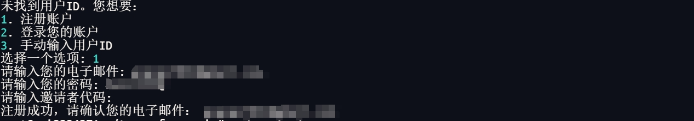
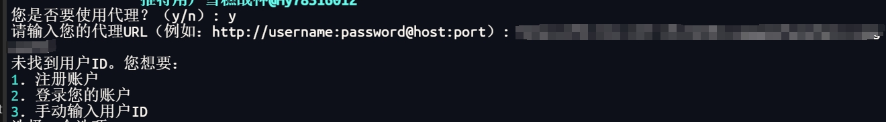
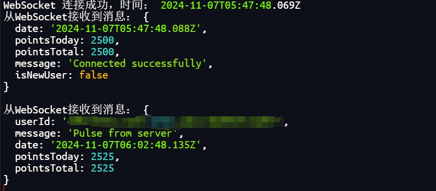

# TENEO-NODE

运行 Teneo Node BETA，CLI 版本。<br>
Teneo 是一个基于浏览器扩展的节点。<br>

通过运行一个访问公共社交媒体数据的节点，您可以获得 $TENEO 代币的报酬。。

## 💡 如何注册

- **无需下载扩展，您可以使用脚本注册**


## 🚨 在运行 Teneo CLI 版本之前的注意事项

我不对由于在 CLI 中运行节点而导致的账户被 `禁止` 的可能性负责，因为官方的 `Teneo Node Beta` 并未提供 CLI 版本的选项，只有 Chrome 扩展。不过我认为没有理由会禁止账户，因为这并不是作弊，我没有更改脚本中的任何内容（心跳 15 分钟，最大 teneo 点数 25，每天最大点数 2400）。

## 📎 Teneo Node CLI 版本脚本功能

- 注册
- 登录
- 运行节点
- 自动登录
- 自动重连



## 📌 运行时截图



## ✎ᝰ. 运行步骤
- 克隆仓库
```bash
git clone https://github.com/Gzgod/Teneo.git
cd Teneo
```
- 安装依赖
```bash
npm install
```
- 运行脚本
```bash
node main.js
```
